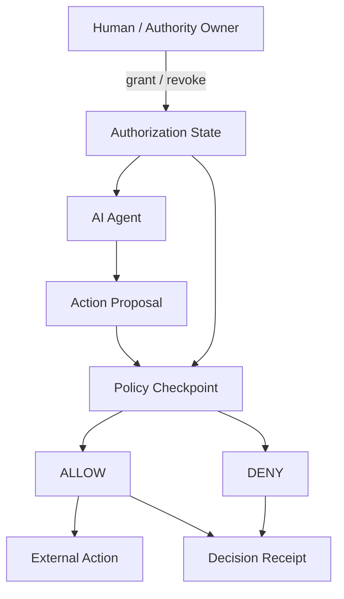
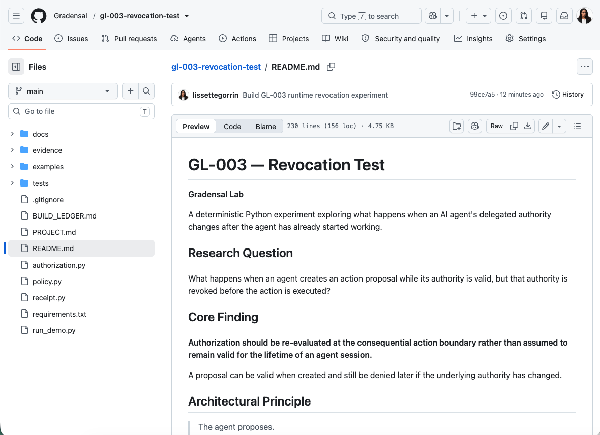

# GL-003 — Revocation Test

**Gradensal Lab**

A deterministic Python experiment exploring what happens when an AI agent's delegated authority changes after the agent has already started working.

## Research Question

What happens when an agent creates an action proposal while its authority is valid, but that authority is revoked before the action is executed?

## Core Finding

**Authorization should be re-evaluated at the consequential action boundary rather than assumed to remain valid for the lifetime of an agent session.**

A proposal can be valid when created and still be denied later if the underlying authority has changed.

## Architectural Principle

> The agent proposes.  
> The policy layer evaluates current authority.  
> The action boundary enforces the decision.

## Why This Matters

Long-running agents may continue reasoning and planning while permissions, organizational policies, user intent, or delegated authority change.

Checking authorization only when an agent session begins can therefore create a stale-authority problem.

GL-003 models a simple alternative: evaluate current authority again immediately before a consequential action.

## Architecture



## Authorization Lifecycle

```text
ACTIVE
  |
  | revoke()
  v
REVOKED

ACTIVE
  |
  | expiration time reached
  v
EXPIRED
```

## Controlled Scenarios

The demo exercises four primary scenarios.

| Scenario | State at Action Boundary | Expected Result |
|---|---|---|
| Active authority | ACTIVE | ALLOW |
| Revoked authority | REVOKED | DENY |
| Expired authority | EXPIRED | DENY |
| Proposal created before revocation | REVOKED at execution | DENY |

The fourth scenario is the central experiment.

The proposal is created while authority is active. Authority is then revoked before execution. The policy layer checks current state again and denies the action.

## Project Structure

```text
authorization.py
policy.py
receipt.py
run_demo.py
tests/
docs/
evidence/
PROJECT.md
BUILD_LEDGER.md
README.md
requirements.txt
```

### `authorization.py`

Models authorization lifecycle and revocation.

### `policy.py`

Evaluates the proposed action against current authorization state.

### `receipt.py`

Produces machine-readable evidence for authorization decisions.

### `run_demo.py`

Runs controlled scenarios and writes decision receipts.

### `tests/`

Automated verification of lifecycle, policy, revocation, expiration, agent mismatch, and receipt behavior.

## Run Locally

Create and activate a Python environment:

```bash
python3 -m venv .venv
source .venv/bin/activate
```

Install dependencies:

```bash
pip install -r requirements.txt
```

Run the automated tests:

```bash
pytest -q
```

Run the demonstration:

```bash
python run_demo.py
```

## Expected Demo Result

```text
[1] Active Authority
Decision: ALLOW
Reason: AUTHORIZED

[2] Revoked Authority
Decision: DENY
Reason: AUTHORIZATION_REVOKED

[3] Expired Authority
Decision: DENY
Reason: AUTHORIZATION_EXPIRED

[4] Midrun Revocation
Decision: DENY
Reason: AUTHORIZATION_REVOKED

SUMMARY
1 ALLOW, 3 DENY
```

JSON decision receipts are written to:

```text
evidence/receipts/
```

## Test Coverage

The initial test suite verifies:

```text
active authorization
revoked authorization
expired authorization
mid-run revocation
agent identity mismatch
exact expiration boundary
double-revocation protection
revocation after expiration
decision receipt serialization
```

## Relationship to GL-002

**GL-002 — Agent Intent Receipt** asks:

> What was the agent allowed to do?

GL-003 extends that research question:

> What happens when that authority changes while the agent is already working?

Together they explore the difference between static delegated authority and runtime authorization.

## Scope and Limitations

GL-003 is an educational and research prototype.

It does not provide production identity infrastructure, cryptographic authorization, distributed revocation, secure credential management, real payment execution, sandboxing, or hardened runtime enforcement.

The project demonstrates an architectural principle. It is not a production security system.

## Gradensal Lab Research Direction

GL-001 explores **observability**.

GL-002 explores **delegated authority**.

GL-003 explores **revocation and runtime authorization**.

Together they investigate infrastructure required around increasingly autonomous AI systems.

## Status

**v0.1.0 — deterministic revocation experiment**

Built as part of Gradensal Lab.

## Visual Evidence

The repository includes screenshots from the verified GL-003 experiment and public project release.

### GitHub Project



### Automated Verification


### Mid-Run Revocation


### Demo Summary


The screenshots complement the machine-readable evidence stored in `evidence/receipts/` and the reproducible outputs stored in `evidence/test-results/`.
