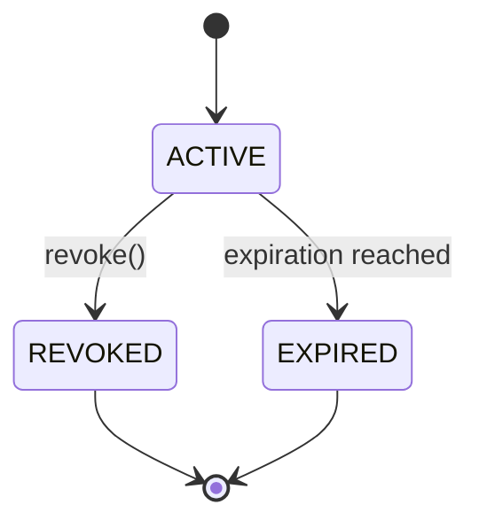
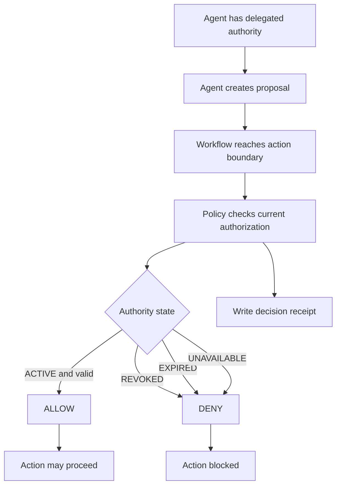
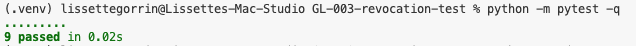
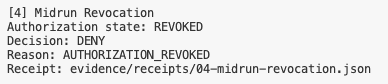
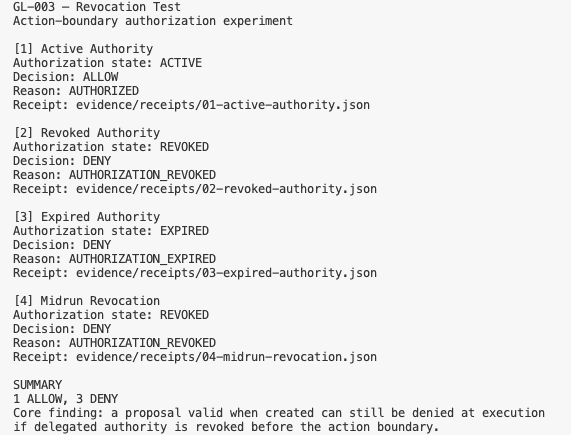
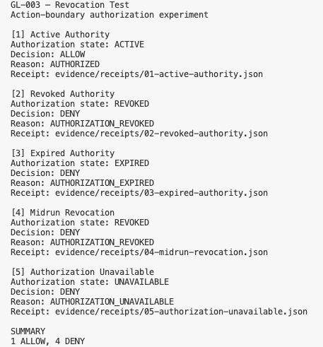

# GL-003 — Revocation Test

### Gradensal Lab · Reliable Agent Systems

[](https://github.com/Gradensal/gl-003-revocation-test/actions/workflows/ci.yml?query=branch%3Amain)


[](LICENSE)

**A deterministic Python experiment investigating what happens when an AI agent's delegated authority changes after the agent has already started working.**

> **An action proposal can be valid when created and still be denied later if the authority behind it has changed.**

GL-003 examines a runtime authorization problem in longer-running agent workflows: **approval at the start of a task does not necessarily authorize a later consequential action.**

This is a controlled research prototype, not a production identity provider or agent security gateway.

---

## Research Question

**What happens when an agent creates an action proposal while its authority is valid, but that authority is revoked before execution?**

A related question is what should happen when current authorization is expired or unavailable. GL-003 tests a conservative policy: re-evaluate authority at the action boundary and deny execution if required authority is no longer valid or cannot be established.

## Core Finding

**Authorization should be evaluated against the current state at the consequential action boundary, rather than assumed to remain valid for the lifetime of an agent session.**

```text
AUTHORITY ACTIVE
       |
       v
PROPOSAL CREATED
       |
       v
AUTHORITY REVOKED
       |
       v
ACTION BOUNDARY
       |
       v
CURRENT AUTHORITY CHECKED
       |
       v
DENY
```

The proposal does not preserve authority. A deterministic policy layer evaluates the relevant authorization state when the action is considered for execution.

### Architectural principle

```text
Agent proposes an action
          |
          v
Policy evaluates current authority
          |
          v
Action boundary enforces ALLOW or DENY
          |
          v
Decision receipt records the outcome
```

This design illustrates the separation between **agent intent**, **authorization decisions**, and **execution enforcement**.

---

## Why This Matters

An agent may continue planning or working while circumstances change:

- A user revokes permission.
- Delegated authority reaches its expiration time.
- An organizational policy changes.
- An agent's permitted scope is narrowed.
- The authorization service becomes unavailable.

A check performed only when a workflow begins can leave the system relying on **stale authority**. GL-003 explores rechecking before a consequential action as a control against that failure mode.

This experiment does **not** establish that every real-world time-of-check/time-of-use race is eliminated. Distributed tool execution requires additional coordination and enforcement.

---

## Controlled Experiment

The demonstration exercises five synthetic authorization scenarios.

| Scenario | State at action boundary | Expected decision | Reason |
|---|---|---|---|
| Active authority | `ACTIVE` | `ALLOW` | `AUTHORIZED` |
| Revoked authority | `REVOKED` | `DENY` | `AUTHORIZATION_REVOKED` |
| Expired authority | `EXPIRED` | `DENY` | `AUTHORIZATION_EXPIRED` |
| Mid-run revocation | `REVOKED` | `DENY` | `AUTHORIZATION_REVOKED` |
| Authorization unavailable | `UNAVAILABLE` | `DENY` | `AUTHORIZATION_UNAVAILABLE` |

**The central scenario is mid-run revocation.** The action proposal is created while authorization is active. Authority is then revoked **before execution**. At the action boundary, the policy checks current authority and denies the action.

The unavailable-state scenario tests **fail-closed behavior**: inability to verify required authorization is not interpreted as permission.

### Previously documented demonstration result

```text
GL-003 — Revocation Test
Action-boundary authorization experiment

[1] Active Authority
Authorization state: ACTIVE
Decision: ALLOW
Reason: AUTHORIZED

[2] Revoked Authority
Authorization state: REVOKED
Decision: DENY
Reason: AUTHORIZATION_REVOKED

[3] Expired Authority
Authorization state: EXPIRED
Decision: DENY
Reason: AUTHORIZATION_EXPIRED

[4] Midrun Revocation
Authorization state: REVOKED
Decision: DENY
Reason: AUTHORIZATION_REVOKED

[5] Authorization Unavailable
Authorization state: UNAVAILABLE
Decision: DENY
Reason: AUTHORIZATION_UNAVAILABLE

SUMMARY
1 ALLOW, 4 DENY
```

This output is preserved from the existing project README. **Re-run the demonstration and verify it against the intended release commit before describing it as a freshly reproduced result.**

Run:

```bash
python run_demo.py
```

The demonstration writes machine-readable decision receipts under `evidence/receipts/`.

---

## Authorization Lifecycle

GL-003 models active, revoked, and expired authorization states. `UNAVAILABLE` describes a failure to establish the current state at the action boundary.



An earlier active state cannot, on its own, override a later revoked or expired state.

## Runtime Decision Flow



The diagrams illustrate the experiment's conceptual architecture; they are not a guarantee of production-grade atomic enforcement.

---

## Decision Receipts and Evidence

The controlled demonstration records machine-readable evidence for each scenario:

```text
evidence/
├── receipts/
│   ├── 01-active-authority.json
│   ├── 02-revoked-authority.json
│   ├── 03-expired-authority.json
│   ├── 04-midrun-revocation.json
│   └── 05-authorization-unavailable.json
├── screenshots/
└── test-results/
```

Receipts allow a reviewer to inspect the authorization state, the resulting decision, and its reason. They are helpful for debugging and traceability; their existence does **not** by itself prove tamper resistance or cryptographic integrity.

The repository's recorded test and demo outputs are located in `evidence/test-results/`. Where historical screenshots show earlier test counts, their filenames are preserved as historical evidence rather than silently relabeled.

---

## Automated Verification

The existing README documents **11 automated tests** covering:

1. Active authorization
2. Revoked authorization
3. Expired authorization
4. Mid-run revocation
5. Agent identity mismatch
6. Exact expiration boundary
7. Double-revocation protection
8. Revocation after expiration
9. Decision receipt serialization
10. Fail-closed behavior when authorization is unavailable
11. Auditable receipt generation when authorization cannot be established

Run from the repository root:

```bash
python -m pytest -q
```

The prior documented result was **11 passing tests**. Confirm the current count from a new run; this README update does not constitute a new test execution.

Check code style and linting:

```bash
ruff check .
```

The prior README recorded a successful Ruff check. Run it again on the release checkout.

### Continuous integration

The GitHub Actions workflow at `.github/workflows/ci.yml` is configured in the existing project for pushes and pull requests to `main`. Its documented steps include:

```text
CHECK OUT REPOSITORY
        |
        v
SET UP PYTHON 3.12
        |
        v
INSTALL DEPENDENCIES
        |
        v
RUN RUFF
        |
        v
RUN AUTOMATED TESTS
        |
        v
RUN REVOCATION DEMONSTRATION
```

[View the CI workflow](https://github.com/Gradensal/gl-003-revocation-test/actions/workflows/ci.yml)

A release should reference a successful run **for the release commit**, not rely exclusively on an earlier passing workflow.

---

## Project Structure

The following lists the main files documented by the existing project. The exact checkout should be inspected before releasing.

```text
gl-003-revocation-test/
├── .github/
│   └── workflows/
│       └── ci.yml
├── docs/
│   └── architecture.md
├── evidence/
│   ├── receipts/
│   │   ├── 01-active-authority.json
│   │   ├── 02-revoked-authority.json
│   │   ├── 03-expired-authority.json
│   │   ├── 04-midrun-revocation.json
│   │   └── 05-authorization-unavailable.json
│   ├── screenshots/
│   │   ├── 01-github-readme.png
│   │   ├── 02-pytest-9-passed.png
│   │   ├── 03-demo-midrun-revocation.png
│   │   ├── 04-demo-summary.png
│   │   └── 05-fail-closed-authorization-demo.png
│   └── test-results/
│       ├── demo.txt
│       └── pytest.txt
├── examples/
│   └── README.md
├── tests/
│   └── test_revocation.py
├── authorization.py
├── policy.py
├── receipt.py
├── run_demo.py
├── pyproject.toml
├── requirements.txt
├── requirements-dev.txt
├── PROJECT.md
├── BUILD_LEDGER.md
├── LICENSE
└── README.md
```

### Main components

| File | Responsibility |
|---|---|
| `authorization.py` | Models authorization lifecycle and validity. |
| `policy.py` | Evaluates proposed actions against current authorization. |
| `receipt.py` | Produces machine-readable decision evidence. |
| `run_demo.py` | Exercises five controlled scenarios and writes receipts. |
| `tests/test_revocation.py` | Verifies lifecycle, policy, identity and receipt behavior. |
| `docs/architecture.md` | Documents architecture and decisions. |
| `BUILD_LEDGER.md` | Preserves engineering progress and lessons. |

---

## Run Locally

### 1. Clone the repository

```bash
git clone https://github.com/Gradensal/gl-003-revocation-test.git
cd gl-003-revocation-test
```

### 2. Create and activate a virtual environment

```bash
python3 -m venv .venv
source .venv/bin/activate
```

On Windows PowerShell, activation uses `.venv\Scripts\Activate.ps1` instead.

### 3. Install development dependencies

```bash
python -m pip install --upgrade pip
python -m pip install -r requirements-dev.txt
```

### 4. Run lint and tests

```bash
ruff check .
python -m pytest -q
```

### 5. Run the demonstration

```bash
python run_demo.py
```

Inspect `evidence/receipts/` to examine the decisions. The demo works on synthetic authorization conditions and does not require access to real enterprise accounts.

If imports or commands fail, verify that you are in the repository root, that the virtual environment is active, and that development dependencies were installed successfully.

---

## Visual Evidence

### Historical automated verification



*Historical screenshot: nine passing tests at an earlier milestone. The later documented suite includes eleven tests; use a new screenshot for final-release test evidence.*

### Mid-run revocation



### Five-scenario demonstration



### Fail-closed authorization



The unavailable-state case illustrates a `DENY` decision with reason `AUTHORIZATION_UNAVAILABLE`. These screenshots supplement, rather than replace, the machine-readable receipts and repeatable tests.

---

## Engineering Trade-offs and Limitations

GL-003 is an **independent research prototype**. It demonstrates defined behaviors in a synthetic execution environment and does not provide:

- Production authentication, identity or credential management
- Authenticated, tamper-resistant revocation events
- Distributed revocation propagation or consistency guarantees
- Atomic authorization-and-tool-execution semantics
- Proven defense against concurrent time-of-check/time-of-use races
- Sandboxing or hardened tool execution
- Production policy administration or audit retention controls
- Latency, throughput, reliability or cost benchmarks
- Real customer, payment or external-system integration

### Fail closed versus availability

Denying actions when authorization status is unavailable supports conservative enforcement. It can also interrupt legitimate work during service failures. A production implementation needs a proportionate policy, clear recovery behavior, and a plan for authorization freshness and service availability.

### Decision receipts versus tamper evidence

A JSON receipt makes the decision inspectable, but does not automatically prove that the record cannot be modified. Signed, append-only or otherwise integrity-protected logging would be future work.

### Decision-time check versus atomic enforcement

A check near execution reduces reliance on stale session approval. It does not guarantee that revocation cannot occur in the gap after the check and before the external operation completes.

These boundaries are deliberately documented so that the demonstration is not mistaken for a production security guarantee.

---

## Relationship to Gradensal Lab

GL-003 belongs to Gradensal's investigation of the controls needed as AI systems move from generating answers to performing consequential work.

| Project | Research focus | Question |
|---|---|---|
| [GL-001 — Agent Flight Recorder](https://github.com/Gradensal/agent-flight-recorder) | **Observe** | What did the agent do? |
| [GL-002 — Agent Intent Receipt](https://github.com/Gradensal/gl-002-agent-intent-receipt) | **Authorize** | What was the agent permitted to do? |
| **GL-003 — Revocation Test** | **Revoke** | What happens when authority changes before execution? |

Additional delegation and knowledge-trust experiments have been discussed as research directions. Their existence, implementation and repository status should be verified independently before adding them to a list of completed labs.

### Relationship to GL-002

GL-002 examines authorization evidence associated with an agent's intended work. GL-003 extends that concern into time:

```text
ORIGINAL DELEGATION
        |
        v
What authority was granted?

VERSUS

RUNTIME AUTHORIZATION
        |
        v
Does that authority still exist
when an action is about to occur?
```

The broader research question is:

> **What control infrastructure do we need when AI stops merely generating output and begins participating in consequential work?**

---

## What This Project Demonstrates

GL-003 provides evidence of work on:

- Deterministic authorization and lifecycle modeling
- Revocation and expiration behavior
- Negative-path and boundary-case tests
- Fail-closed decisions under unavailable authorization
- Decision receipts and technical traceability
- Reproducible Python experiments
- Engineering documentation and communication of limitations

These are skills demonstrated within a **solo research prototype**. The project does not demonstrate production identity-system ownership, enterprise deployment, client delivery or team leadership.

### Business relevance

Before allowing an AI agent to perform consequential business actions, an organization should be able to explain how the agent's permissions are granted, checked, revoked, expired and audited. GL-003 offers a concrete, inspectable starting point for discussing the revocation portion of that lifecycle.

---

## Future Research

Possible next experiments:

1. Simulate a race between final authorization check and tool execution.
2. Introduce a real authorization provider or signed delegation token.
3. Compare immediate and eventually consistent revocation propagation.
4. Measure decision latency and effects of authorization-service outages.
5. Investigate policy caching, expiration and revocation freshness.
6. Evaluate tamper-evident receipts and distributed audit logging.

These are **not** included in the demonstrated version unless verified separately.

---

## Research Status

**GL-003 — deterministic runtime revocation research prototype.**

The existing project documentation reports:

- Python 3.12 environment
- 11 automated tests passing at the previously recorded checkpoint
- Ruff checks passing at the previously recorded checkpoint
- GitHub Actions CI passing at the previously recorded checkpoint
- Five synthetic demonstration scenarios
- Five machine-readable decision receipts
- Demo summary of **1 ALLOW, 4 DENY**

**Release note:** Final documentation and a version tag should be published only after confirming the current checkout, re-running tests and the demo, and verifying CI for the selected commit. A version label in historical project notes is not, by itself, proof that a corresponding GitHub Release exists.

---

## About Gradensal Lab

Gradensal Lab builds focused, inspectable experiments around AI systems, intelligent workflows and enterprise automation. The aim is to understand not only whether an agent can perform a task, but also what evidence and controls support its behavior.

**Applied AI · Reliable Agents · Intelligent Workflows · Enterprise Automation**

[Gradensal](https://gradensal.com) · [GitHub organization](https://github.com/Gradensal) · [Lissette Gorrin Rodriguez](https://lissettegorrin.com/)

## License

See [LICENSE](LICENSE) for the repository's license terms.
