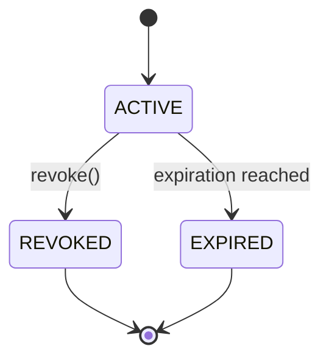
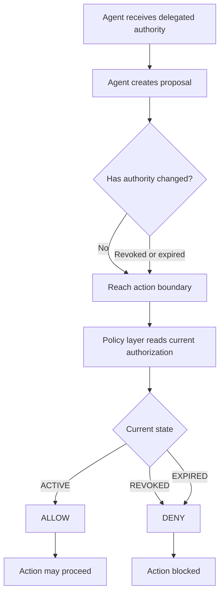

# GL-003 — Revocation Test

### Gradensal Lab

[](https://github.com/Gradensal/gl-003-revocation-test/actions/workflows/ci.yml?query=branch%3Amain)


[](LICENSE)

**A deterministic Python experiment exploring what happens when an AI agent's delegated authority changes after the agent has already started working.**

GL-003 investigates a runtime authorization problem that becomes increasingly important as AI agents operate for longer periods and perform more consequential actions:

> **A proposal can be valid when created and still be denied later if the underlying authority has changed.**

---

## Research Question

**What happens when an agent creates an action proposal while its authority is valid, but that authority is revoked before the action is executed?**

The experiment tests whether authorization should be treated as a one-time session decision or re-evaluated immediately before a consequential action.

---

## Core Finding

**Authorization should be re-evaluated at the consequential action boundary rather than assumed to remain valid for the lifetime of an agent session.**

GL-003 demonstrates a simple but important sequence:

```text
AUTHORITY ACTIVE
      │
      ▼
PROPOSAL CREATED
      │
      ▼
AUTHORITY REVOKED
      │
      ▼
ACTION BOUNDARY
      │
      ▼
CURRENT AUTHORITY RE-EVALUATED
      │
      ▼
DENY
```

The proposal itself does not preserve authority.

The policy layer evaluates the **current** authorization state at execution time.

---

## Architectural Principle

GL-003 separates three responsibilities:

```text
The agent proposes.
        ↓
The policy layer evaluates current authority.
        ↓
The action boundary enforces the decision.
```

This prevents an agent from relying indefinitely on authority that existed earlier in its session.

---

## Why This Matters

Long-running agents may continue planning and reasoning while the environment around them changes.

During that time:

- a user may revoke permission;
- delegated authority may expire;
- organizational policy may change;
- an agent's permitted scope may be reduced;
- the intended action may no longer be authorized.

If authorization is checked only when an agent starts, the system can develop a **stale-authority problem**.

GL-003 models an alternative:

> **Check current authority again immediately before the consequential action.**

---

## Controlled Experiment

The demonstration exercises four authorization scenarios.

| Scenario | State at Action Boundary | Decision |
|---|---|---|
| Active authority | `ACTIVE` | `ALLOW` |
| Revoked authority | `REVOKED` | `DENY` |
| Expired authority | `EXPIRED` | `DENY` |
| Proposal created before revocation | `REVOKED` at execution | `DENY` |

The fourth scenario is the central experiment.

The proposal is created while authority is active.

Authority is then revoked **before execution**.

When the action boundary is reached, the policy layer checks the current authorization state again and denies the action.

---

## Verified Result

Running:

```bash
python run_demo.py
```

produces:

```text
GL-003 — Revocation Test
Action-boundary authorization experiment

[1] Active Authority
Authorization state: ACTIVE
Decision: ALLOW
Reason: AUTHORIZED

[2] Revoked Authority
Authorization state: REVOKED
Decision: DENY
Reason: AUTHORIZATION_REVOKED

[3] Expired Authority
Authorization state: EXPIRED
Decision: DENY
Reason: AUTHORIZATION_EXPIRED

[4] Midrun Revocation
Authorization state: REVOKED
Decision: DENY
Reason: AUTHORIZATION_REVOKED

SUMMARY
1 ALLOW, 3 DENY
```

The experiment therefore demonstrates:

> **A proposal valid when created can still be denied at execution if delegated authority is revoked before the action boundary.**

Machine-readable decision receipts are written to:

```text
evidence/receipts/
```

---

## Authorization Lifecycle

GL-003 models active, revoked, and expired authorization states.



The important architectural distinction is that authorization state is not assumed to remain static during the lifetime of an agent session.

---

## Runtime Decision Flow



The proposal does not determine the final authorization decision.

The current authorization state does.

---

## Decision Receipts

GL-003 records machine-readable evidence for each controlled scenario.

```text
evidence/
└── receipts/
    ├── 01-active-authority.json
    ├── 02-revoked-authority.json
    ├── 03-expired-authority.json
    └── 04-midrun-revocation.json
```

These receipts provide inspectable evidence of:

- authorization state;
- policy decision;
- reason for the decision;
- scenario outcome.

The repository also preserves reproducible test and demonstration evidence under:

```text
evidence/test-results/
```

---

## Automated Verification

The project currently contains **9 passing automated tests** covering:

- active authorization;
- revoked authorization;
- expired authorization;
- mid-run revocation;
- agent identity mismatch;
- exact expiration boundary;
- double-revocation protection;
- revocation after expiration;
- decision receipt serialization.

Run:

```bash
pytest
```

Expected result:

```text
......... [100%]
9 passed
```

Code quality is checked with Ruff:

```bash
ruff check .
```

Expected result:

```text
All checks passed!
```

---

## Continuous Integration

GitHub Actions verifies the project automatically on pushes and pull requests to `main`.

The CI pipeline performs:

```text
CHECK OUT REPOSITORY
        ↓
SET UP PYTHON 3.12
        ↓
INSTALL DEPENDENCIES
        ↓
RUN RUFF
        ↓
RUN 9 AUTOMATED TESTS
        ↓
RUN REVOCATION EXPERIMENT
```

This means the repository does not rely only on locally captured evidence.

The current implementation is re-evaluated automatically by CI.

---

## Project Structure

```text
gl-003-revocation-test/
├── .github/
│   └── workflows/
│       └── ci.yml
├── docs/
│   └── architecture.md
├── evidence/
│   ├── receipts/
│   │   ├── 01-active-authority.json
│   │   ├── 02-revoked-authority.json
│   │   ├── 03-expired-authority.json
│   │   └── 04-midrun-revocation.json
│   ├── screenshots/
│   │   ├── 01-github-readme.png
│   │   ├── 02-pytest-9-passed.png
│   │   ├── 03-demo-midrun-revocation.png
│   │   └── 04-demo-summary.png
│   └── test-results/
│       ├── demo.txt
│       └── pytest.txt
├── examples/
│   └── README.md
├── tests/
│   └── test_revocation.py
├── authorization.py
├── policy.py
├── receipt.py
├── run_demo.py
├── pyproject.toml
├── requirements.txt
├── requirements-dev.txt
├── PROJECT.md
├── BUILD_LEDGER.md
└── README.md
```

### `authorization.py`

Models the authorization lifecycle, including active, revoked, and expired states.

### `policy.py`

Evaluates proposed actions against the current authorization state.

### `receipt.py`

Produces machine-readable evidence for authorization decisions.

### `run_demo.py`

Runs the four controlled scenarios and writes their decision receipts.

### `tests/`

Provides automated verification of lifecycle, policy, revocation, expiration, identity matching, and receipt behavior.

---

## Run Locally

Clone the repository:

```bash
git clone https://github.com/Gradensal/gl-003-revocation-test.git
cd gl-003-revocation-test
```

Create a Python environment:

```bash
python3 -m venv .venv
source .venv/bin/activate
```

Install development dependencies:

```bash
python -m pip install --upgrade pip
pip install -r requirements-dev.txt
```

Run code-quality checks:

```bash
ruff check .
```

Run the automated tests:

```bash
pytest
```

Run the controlled experiment:

```bash
python run_demo.py
```

Decision receipts will be written to:

```text
evidence/receipts/
```

---

## Visual Evidence

### Automated Verification


### Mid-Run Revocation


### Controlled Experiment Summary


The screenshots complement the machine-readable receipts and reproducible test evidence stored in the repository.

---

## Relationship to the Gradensal Reliable Agent Research Program

GL-003 is one experiment within a broader sequence investigating infrastructure around increasingly autonomous AI systems.

| Lab | Control Layer | Research Question |
|---|---|---|
| **GL-001 — Agent Flight Recorder** | **OBSERVE** | What did the agent do? |
| **GL-002 — Agent Intent Receipt** | **AUTHORIZE** | What authority was the agent given? |
| **GL-003 — Revocation Test** | **REVOKE** | What happens when that authority changes mid-run? |
| **GL-004 — Agent Delegation Boundary** | **DELEGATE** | When may the agent act without asking a human? |
| **GL-005 — Agent Knowledge Trust Gate** | **VERIFY** | Is the knowledge behind the proposed action trustworthy enough? |

```text
OBSERVE → AUTHORIZE → REVOKE → DELEGATE → VERIFY
```

The broader research question is:

> **What control infrastructure do we need when AI stops merely generating output and begins participating in consequential work?**

### Related Projects

- [GL-001 — Agent Flight Recorder](https://github.com/Gradensal/agent-flight-recorder)
- [GL-002 — Agent Intent Receipt](https://github.com/Gradensal/gl-002-agent-intent-receipt)
- [GL-004 — Agent Delegation Boundary](https://github.com/Gradensal/gl-004-agent-delegation-boundary)
- [GL-005 — Agent Knowledge Trust Gate](https://github.com/Gradensal/gl-005-agent-knowledge-trust-gate)

---

## Relationship to GL-002

GL-002 — Agent Intent Receipt asks:

> **What was the agent allowed to do?**

GL-003 extends that question:

> **What happens when that authority changes while the agent is already working?**

Together, the two experiments demonstrate the distinction between:

```text
STATIC DELEGATED AUTHORITY
            ↓
what authority was originally granted

versus

RUNTIME AUTHORIZATION
            ↓
whether that authority still exists
when the action is about to occur
```

---

## Security Model

GL-003 intentionally keeps the authorization model small and deterministic so that the experiment can isolate the revocation problem.

The project does **not** claim to provide a complete production authorization system.

A production implementation would require additional controls around areas such as identity, credential security, distributed policy state, authenticated revocation events, concurrency, persistence, and enforcement infrastructure.

---

## Scope and Limitations

GL-003 is an **educational and research prototype**.

It does not provide:

- production identity infrastructure;
- cryptographic authorization;
- distributed revocation;
- secure credential management;
- real payment execution;
- sandboxing;
- hardened runtime enforcement;
- distributed consistency guarantees;
- production policy administration.

The authorization states, scenarios, and policy rules are deliberately simplified so the experiment can focus on one architectural principle:

> **Authority should be checked when the consequential action is about to occur—not merely when the agent session begins.**

---

## Research Status

**v0.1.0 — deterministic runtime revocation experiment**

Current verified state:

```text
Python 3.12
9 automated tests passing
Ruff quality checks passing
GitHub Actions CI passing
4 controlled authorization scenarios
4 machine-readable decision receipts
Reproducible mid-run revocation experiment
```

GL-003 remains a research prototype rather than a production security system.

---

## Gradensal Lab

Gradensal Lab builds small, inspectable experiments around emerging AI system architecture.

The goal is not merely to demonstrate that an AI capability can work.

The goal is to investigate the infrastructure required to make increasingly autonomous systems **observable, authorized, revocable, governable, and trustworthy**.

**Applied AI · Reliable Agents · Intelligent Workflows · Enterprise Automation**

[gradensal.com](https://gradensal.com)